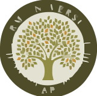

<p align="center">
  
</p>

# Campus Connect 🎓

<p align="center">
  <b>Transforming campus life with a unified platform for students to connect, collaborate, and thrive.</b>
</p>

<p align="center">
  
  
  
</p>


---

## 🌟 Our Mission

Campus Connect builds a more connected, supportive, and efficient campus community where students can:

- 🏆 Organize sports activities and competitions
- ✈️ Coordinate group travels and outings
- 🎮 Create gaming sessions
- 👥 Find teammates and roommates
- 💬 Connect with fellow students instantly
- 📋 Manage lost & found items


## 🚀 Getting Started

### Prerequisites

- [Node.js 16+](https://nodejs.org/)
- npm or yarn
- [MongoDB](https://www.mongodb.com/) database
- [Clerk](https://clerk.com/) account (for authentication)

### Quick Start

1. **Clone the repository**
   ```bash
   git clone <repository-url>
   cd CampusConnect
   ```

2. **Install dependencies**
   ```bash
   cd client && npm install
   cd ../server && npm install
   ```

3. **Configure environment variables**
   ```bash
   cp .env.example .env
   # Edit .env and add your MongoDB URI and Clerk API keys
   ```

4. **Start the development servers**

   - **Backend:**
     ```bash
     cd server
     npm start
     ```
   - **Frontend:** (in a new terminal)
     ```bash
     cd client
     npm run dev
     ```

5. **Access the app:**
   - Frontend: [http://localhost:5173](http://localhost:5173)
   - Backend API: [http://localhost:5000](http://localhost:5000)


---

## 🏗️ Project Structure

```
campus-connect-main/
├── client/                 # React frontend application
│   ├── src/
│   │   ├── components/     # Reusable UI components
│   │   ├── pages/         # Page components
│   │   ├── api.js        # API utilities
│   │   └── ...
│   └── public/            # Static assets
├── server/                # Node.js backend server
│   ├── proxy.mjs         # Main server with profanity detection
│   ├── package.json      # Server dependencies
│   └── .env.example      # Environment variables template
└── README.md             # This file
```


---

## 🛠️ Tech Stack

### Frontend
- **React 18** - Modern UI framework
- **Vite** - Fast build tool and development server
- **Tailwind CSS** - Utility-first CSS framework
- **Clerk** - Authentication and user management
- **Material-UI Icons** - Professional icon components
- **React Router** - Client-side routing

### Backend
- **Node.js** - JavaScript runtime
- **Express.js** - Web application framework
- **MongoDB** - Database for storing application data
- **Mongoose** - MongoDB object modeling
- **Clerk SDK** - Server-side authentication
- **Hugging Face API** - AI-powered profanity detection


---

## ✨ Features

### 👤 User Features
- **Clerk Authentication** - Secure login with university email
- **Profile Management** - Personalized user profiles
- **Request System** - Create and manage various types of requests
- **Real-time Chat** - Instant messaging with profanity filtering
- **Search & Filter** - Find relevant requests easily
- **Responsive Design** - Works on all device sizes

### 🔧 Request Types
- **Projects & Competitions** - Find team members
- **Sports Activities** - Organize games and tournaments
- **Travel & Outings** - Plan group trips
- **Lost & Found** - Report and find lost items
- **Roommate Matching** - Find compatible roommates


---

## 🔐 Security Features

- University email domain validation (@srmap.edu.in)
- AI-powered profanity detection in chat
- Secure Clerk authentication
- Request validation and sanitization


---

## 🎯 Recent Optimizations

✅ **Migration to Modern Stack**
- Replaced Firebase with MongoDB for data storage
- Replaced Firebase Auth with Clerk for authentication
- Updated all components to use REST API instead of Firestore
- Enhanced server architecture with proper MVC patterns

✅ **Code Quality Improvements**
- Removed all unnecessary ESLint disable comments
- Fixed component naming conventions
- Cleaned up unused imports and dependencies
- Standardized code formatting

✅ **Performance Enhancements**
- Removed unused dependencies (react-spring, framer-motion, firebase)
- Optimized image imports from public directory
- Improved Vite configuration
- Enhanced MongoDB configuration

✅ **Security Updates**
- Fixed all npm security vulnerabilities
- Updated dependencies to latest secure versions
- Improved server architecture

✅ **Architecture Cleanup**
- Removed redundant server files
- Consolidated server functionality into single entry point
- Created proper environment configuration
- Updated documentation


---

## 📝 Environment Variables

Create a `.env` file in the server directory:

```env
# MongoDB Configuration
MONGODB_URI=your_mongodb_connection_string_here

# Clerk Configuration
CLERK_PUBLISHABLE_KEY=your_clerk_publishable_key_here
CLERK_SECRET_KEY=your_clerk_secret_key_here

# Optional: Hugging Face API Key for profanity detection
HF_API_KEY=your_hugging_face_api_key_here
```

**Note:** The application runs without the API key, but profanity detection will be disabled.


---

## 🤝 Contributing

1. Fork the repository
2. Create your feature branch (`git checkout -b feature/amazing-feature`)
3. Commit your changes (`git commit -m 'Add amazing feature'`)
4. Push to the branch (`git push origin feature/amazing-feature`)
5. Open a Pull Request


---

## 📄 License

This project is licensed under the MIT License.

---


---

## 📬 Contact & Support

For questions, suggestions, or support, please open an [issue](https://github.com/suman2807/CampusConnect/issues) or contact the maintainer at [your-email@domain.com].

---

<p align="center"><b>Built with ❤️ by students, for students — Campus Connect is more than an app. It's your campus, connected.</b></p>
